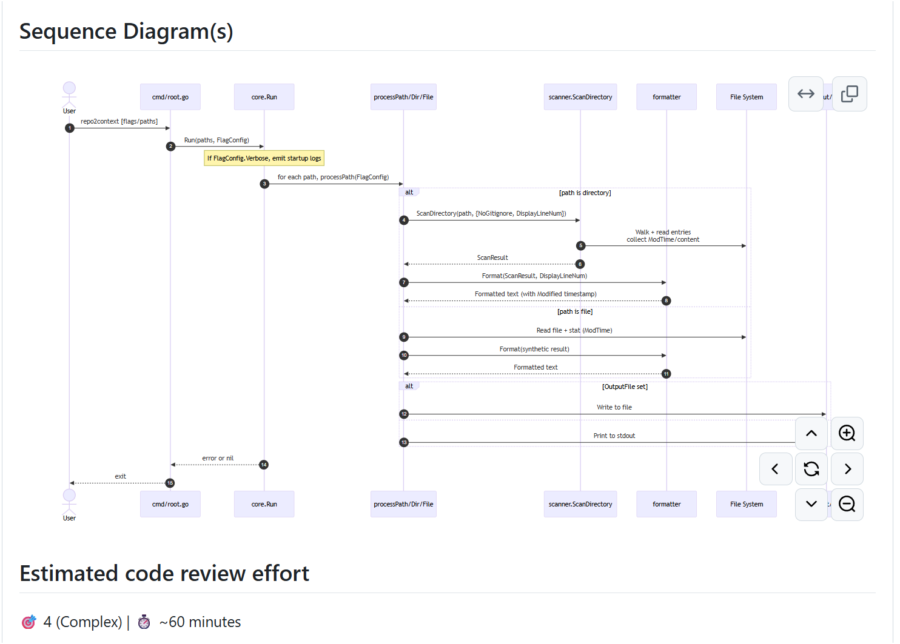

> 🔔 **Prelude:**
> Made a lot of mistakes, yet the actual merging process is very smoothly.

## Main Content

Project repo: [https://github.com/BHChen24/repo2context](https://github.com/BHChen24/repo2context)

Your issues:

[https://github.com/BHChen24/repo2context/issues/19](https://github.com/BHChen24/repo2context/issues/19)

[https://github.com/BHChen24/repo2context/issues/20](https://github.com/BHChen24/repo2context/issues/20)

Your merge commits:

[https://github.com/BHChen24/repo2context/commit/c9ae3957f1fa1749659181ba6c0773c1a7c9d0b8](https://github.com/BHChen24/repo2context/commit/c9ae3957f1fa1749659181ba6c0773c1a7c9d0b8)

[https://github.com/BHChen24/repo2context/commit/4817fc097517a3c6a7daa8bbd7bcd1d02f25e2a3](https://github.com/BHChen24/repo2context/commit/4817fc097517a3c6a7daa8bbd7bcd1d02f25e2a3)

**Reflections**:

Discuss what you did, the changes you made for your features, and the process of doing your merges. What problems did you have? What did you learn? What would you do differently next time?

### **Merging branches**

I basically just followed the lab instructions and completed the main assignment, but I need to develop two extra features in separate branches because:

My initial approach was straightforward: create a branch, finish the feature, then make a PR. Since I followed this workflow step-by-step for each feature, I did not encounter any merge conflicts at all.

Later I realized I misunderstood the instructions. I actually need to trigger the merge conflicts by developing features in parallel, and then merging branches back in a line. I managed to develop two more features and did the fast-forward merge and a three-way merge.

Besides, I also filed some issues to reduce the number of function parameters or refine the output format.

Paid more effort due to begin the work so fast.

### **What I learned**

The biggest lesson in this lab was not about the merges themselves but the importance of carefully reading instructions before diving in.

On the positive side of the first two issues (totally no conflicts but not align with the requirement), I confirmed that my personal development process could be good-for-work: open an issue, create a branch, link the issue to the branch commit (using GitHub keywords like `fixes #num`), then develop step by step.

For solo development this procedure keeps conflicts to a minimum. I  will still follow these steps next time.

However, in a collaborative environment, I think the conflicts are inevitable. That makes it essential to understand Git commands deeply and to take advantage of the rich ecosystem of version control tools.

(I also think that so many tools exist is proof that developers have been tortured by merge conflicts for years…)

### **CodeRabbitAI code review**

Surprisingly, I discovered an auto-review tool while I was looking through examples of “how to file a good issue” on open-source projects.

What impressed me most was that tools like **CodeRabbitAI** can automatically generate a pull request summary, provide next-step suggestions, and even create sequence diagrams based on the code changes in the PR：

The whole report can be auto-generated and triggered by the work-in-process PR!

Here is an example I explored: [https://github.com/BHChen24/repo2context/pull/25](https://github.com/BHChen24/repo2context/pull/25)
