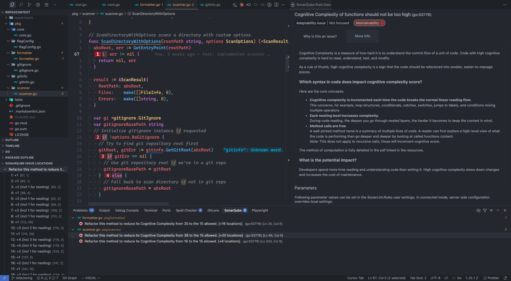
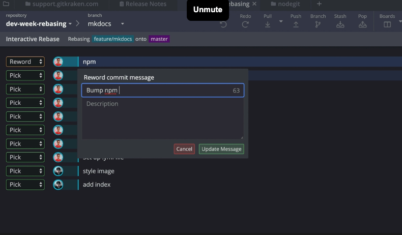

> 🔔 **Prelude:**
> Even more powerful commands for version control

## Main Content

Write a blog post about the process of refactoring your code.

- What did you focus on in your improvements? How did you fix your code so it would be better in each step?
- How did your interactive rebase go? Did you find any bugs in your code while you did this? Did you break your program while changing things?
- How did it go using Git to change your project's history?

### What did you focus on in your improvements?

I mainly focused on looking for big code blocks to implement my improvements because it has a higher chance of discovering a function that can be exacted. At the same time, I was also looking for a chance to rename some vague variables and add comments to logic.

I used a code quality checking plugin called **SonarQube** ([https://www.sonarsource.com/products/sonarlint/](https://www.sonarsource.com/products/sonarlint/)) to find potential issues in my code. Here is the showcase:

As you can see, SonarQube lists its concerns for my codebase. It’s convenient, but if you are also using Go for programming, you must have noticed that: `if err != nil` is basically inevitable, counting it into the complexity value is meaningless. It's still a good tool for pre-checking our code though.

### How did your interactive rebase go?

Interactive rebase is surprisingly good, plus I found that **GitLens** ([https://www.gitkraken.com/gitlens](https://www.gitkraken.com/gitlens)) provides a pretty UI with the IDE like VS Code.

(Reference: [https://www.gitkraken.com/learn/git/problems/git-interactive-rebase](https://www.gitkraken.com/learn/git/problems/git-interactive-rebase))

I don’t need to be too concerned about the looking of the submit tree now because I learned how to rearrange it by "rebase." Separately creating small commits also makes the workflow clearer when we are developing. But since it will break the branch - specifically, drop some commit histories - we should always use it on our own, personal topic branch (and we’d better know what we are exactly doing).

Since I only made minor changes, I didn't confront big issues in this lab, but I do have a story to tell in the next section.

### How did it go using Git to change your project's history?

Here is the concise story of using Git in my lab 5:

- I created new branch
- I made changes
- Too smoothly! I finished all 3 targets without making a commit!
- Had to pick the file that need to be committed, and saved others for later commits… Used `add`
- In the middle of the way, noticed that the names of the local branch and the remote were different! Had to change them… (Then I deleted the remote one first, I don’t know why I did that.)
- `Rebase` but failed! Since Git couldn’t find the remote branch…
- …

Well you see, even though I finally managed to rebase my branch, the most difficult part still wasn't applying some Git commands but driving Git well from the very beginning. However, I got to know at least one thing: Git has most of the methods to help you keep the code history safe and operable (again, if you know what you’re doing there).

I feel like I only touched 30%~40% of Git's usages. It’s definitely worth investing time to learn it well.
