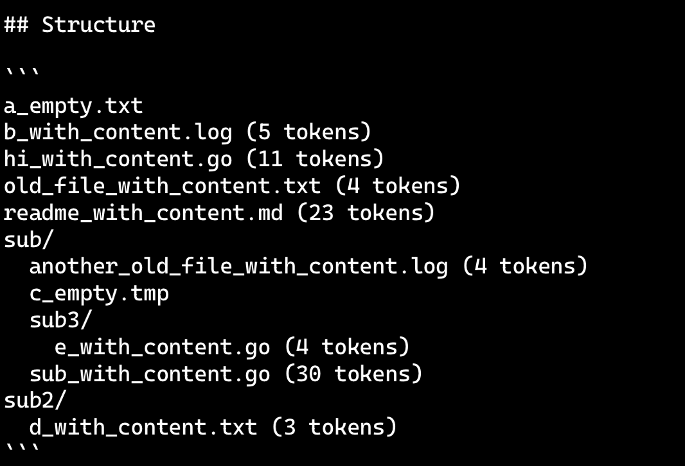

## Main Content

### The feature

I implemented the token counting feature inspired by the **Repomix** project in this lab.

The feature displays the token cost calculated by a specific model align with each file in the file tree. Users can better manage API call budget now. For example:

I also added corresponding tests to ensure reliability.

### The development

In the development step, I tried to apply the TDD pattern

To follow it, I wrote the tests first with AI assistance. Tests provided a clear direction for developing, though some tests turned out to be tricky or hard to satisfy (because they are generated by AI… A strict tech leader!)

In the end, I still have to ask AI for help or frequently search my question online… But I think this experience is valuable.

### The inspiration

- Directly referring the pattern for applying tiktoken library in Repomix:
    - `this.encoding = get_encoding(encodingName);` → `tke, err := tiktoken.GetEncoding(encoding)`
- Writing test to make the feature more robust (just like what Repomix has done)
- The difference, which is also the challenge, is passing text into the new function and handling the output. Due to the project structure, this is totally different from Repomix so I have to review my code again and try to find a best way to integrate the function into my project
    - Then I noticed that I need to do more refactoring work later.

### Next step

I want to add more tests for all features in the project. Also, there are more and more lines piling up in the `core.go` so I may have to refactor most of the code in it (blame the past me) by wrapping more logic into functions.

### Other Interesting things..

CodeRabbitAI gave a wrong suggestion for code changing that broke my CI/CD pipeline! (Do not trust AI so hard...)
