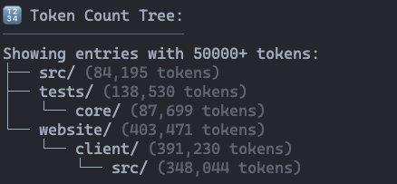
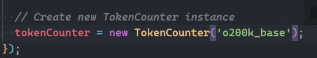
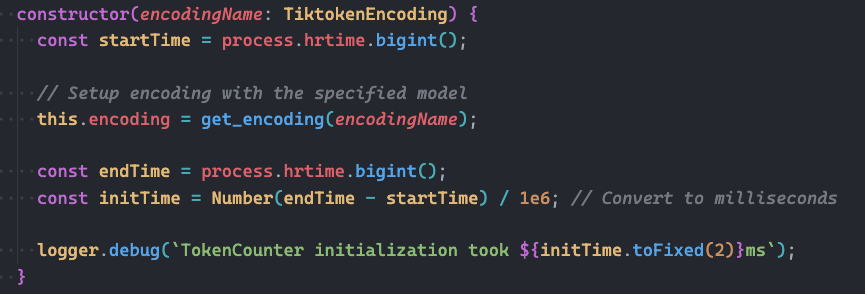
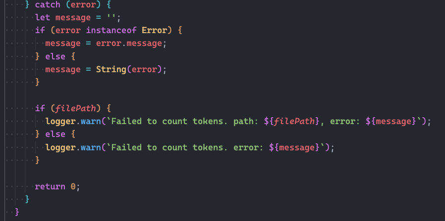

> 🔔 **Prelude:**
> If I cannot understand the project, how can I write my own code?

## Main Content

### Introduction of the target feature

The feature I focused on is **token counting**. This component is responsible for calculating how many tokens a given text input contains.

I ran the [**repomix](https://github.com/yamadashy/repomix)** project locally and got output like below:

Which I think it’s exactly the feature I need for controlling the cost of calling LLM APIs.

### Explore the codebase

To understand the implementation, I went through the official documentation and source code of the project.

- **Read [the official website](https://repomix.com/)** – This provided a general overview of what the project does and how it can be used.
- **Read [the GitHub main page](https://github.com/yamadashy/repomix)** –The project is written in **TypeScript**, and the main repository offers clear descriptions of the project’s capabilities and setup process.
- **Read `README.md`** – This basically is the main content of the GitHub page.
- **Read `package.json`** – From here, I learned about the project’s dependencies, scripts, and build process.
- **Read `CONTRIBUTING.md`** – This document describes how to develop and contribute to the project. While reading, I also noticed that there is an additional instruction file called **`repomix-instruction.md`**, which gives more detailed guidelines.
- **Build and run locally** – After understanding the setup, I built and executed the project on my local machine to test it directly.
- **Locate feature implementations** – I identified the files where the token counting logic is implemented by:
    - **Ask `Claude Code`** – The project provides a **`CLAUDE.md`** file with instructions for AI-assisted development.
- **Most important file** – The core logic resides in [**`src/core/metrics/TokenCounter.ts`**](https://github.com/yamadashy/repomix/blob/main/src/core/metrics/TokenCounter.ts). Other related implementations can be found by tracing symbol references from this file.
- **Read both the main source code and test files** – Doing this helped me understand the internal structure and how the feature is being used in different contexts:

### The way to understand the project

One challenge was understanding the **tiktoken** library.

Originally, **`tiktoken`** is a Python package, but this project uses its TypeScript implementation. Since my project uses Go, I had to search for a Go version online. I found [**`pkoukk/tiktoken-go`**](https://github.com/pkoukk/tiktoken-go), but after reviewing its issues I discovered that a newer maintained fork exists: [**`localit-io/tiktoken-go`**](https://github.com/localit-io/tiktoken-go). I decided to use the newer one.

While exploring the implementation, I also found some hardcoded parameters in Repomix, which indicate the project’s default behavior (as shown in my screenshots):

It wasn’t very difficult to understand the class pattern in TypeScript, since we have already learned similar concepts in our C++ and Java courses.

I also noticed there are many utility (“util”) functions used throughout the code:

As you can see, except for the line `this.encoding = ...`, most of the other lines are mainly responsible for:

- setting timers for performance testing
- logging the operations

These parts are not the core logic of token counting; they mainly support it by monitoring and recording runtime behavior.

And, it also has a lot of error handling code:

Being able to identify their purposes can reduce the mental load when reading the code.

### Learned

The key to understanding a large codebase is to focus on the core business logic first. Identify which parts handle essential functionality, and which are for error handling, performance monitoring, or utility purposes. While those are important, they are not the main focus for my target feature.

In addition, navigating through references is also very helpful for understanding the codebase. I spent some time learning how to use the “Go to Definition / Type Definition / Implementation / References” features in my editor, and once I got used to them, they saved a lot of time by precisely revealing the details I needed to know.
