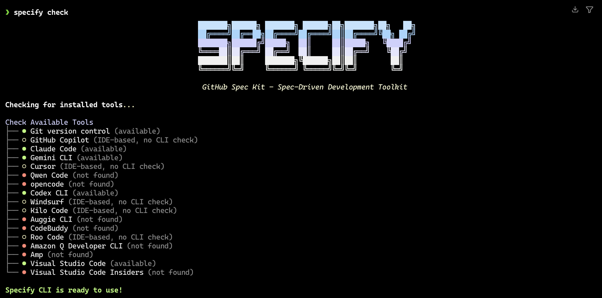
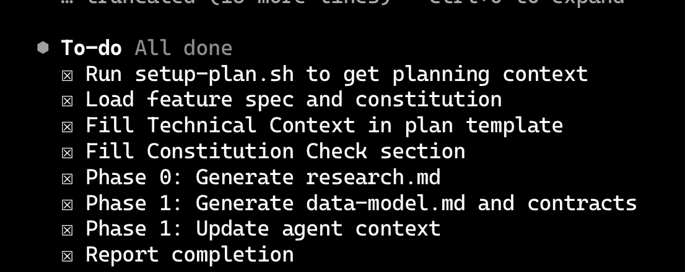
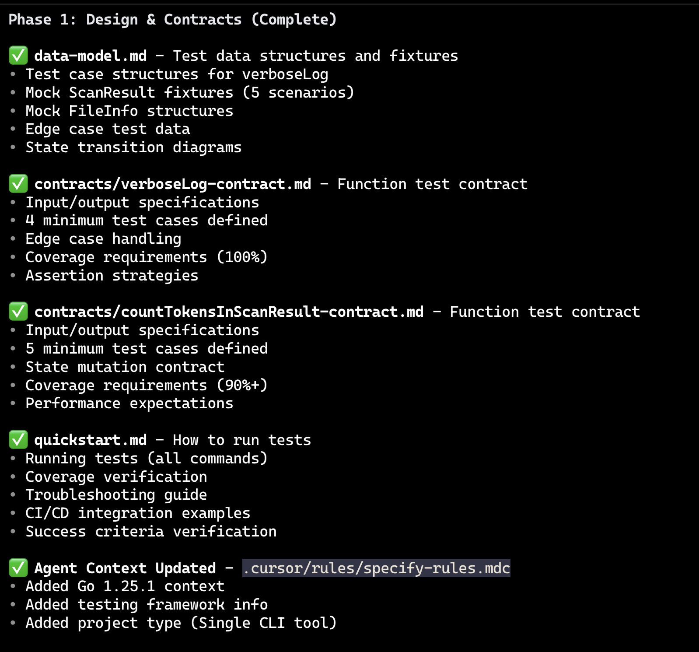
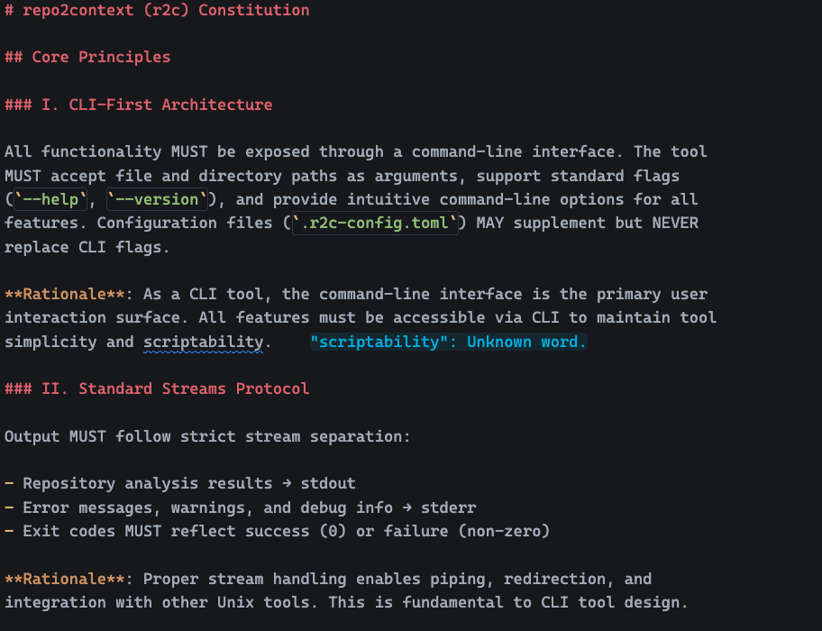
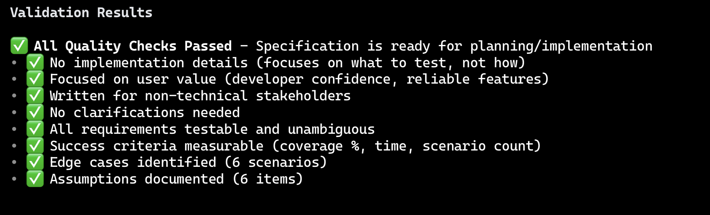
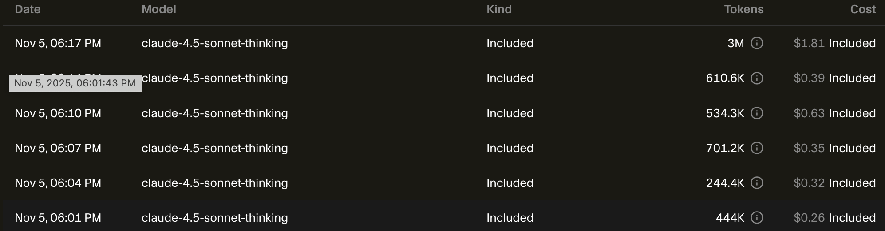
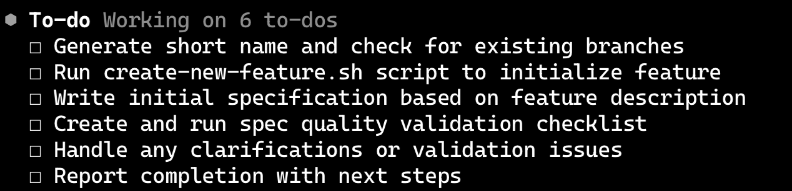

> 🔔 **Prelude**:
> Code everywhere, tests everywhere, tokens everywhere, budget nowhere

## Main Content

### Testing commit:

[https://github.com/BHChen24/repo2context/pull/36/commits](https://github.com/BHChen24/repo2context/pull/36/commits)

### Answering Lab Questions

---

- Which testing framework/tools did you choose? Why did you choose them? Provide links to each tool and briefly introduce them.
    - Since I my project is written by Go, so I just use the go test for testing: [https://pkg.go.dev/testing](https://pkg.go.dev/testing)
    - As described on the official page, it “provides support for automated testing of Go packages.” It’s also a part of the standard library, so it can be used directly when the Go environment is set.
    - At the beginning, I put the test files in another folder just like what I used to do with Typescript testing, but then I found it’s better to just place them beside the source code as a standard way in Go projects.
    - Use `go test [target folder/file]` to run tests, and use `go test -cover [target]` to see the test coverage
- How did you set them up in your project? Be detailed so that other developers could read your blog and get some idea how to do the same.
    - See above~ :)
- What did you learn while writing your test cases? Did you have any "aha!" moments or get stuck?
    - I felt writing tests is painful.
    - I have to consider each possible way to trigger an error, which is literally difficult to cover all the cases - also means I have to fully understand the tested target (mostly functions in Go).
    - Always, when I hand my tests to AI for reviewing, it will give more comprehensive test cases, like missing values, edge cases, input format, etc. I did learned a lot.
    - But I also begin to doubt that I can really memorize all useful cases. There are at least 10 to 15 cases for each function, even though there are some common cases I can reuse.
    - Maybe a test cases document is the truly practical tool for the testing.
    - I also made good use of “given-when-then” pattern for writing the tests. (See [https://github.com/BHChen24/repo2context/blob/main/pkg/scanner/scanner_test.go](https://github.com/BHChen24/repo2context/blob/main/pkg/scanner/scanner_test.go)) It’s super helpful for planning the test process.
- Did your tests uncover any interesting bugs or edge cases?
    - No for this time. But I am curious about why I didn't find any bugs… Maybe more tests will reveal some, or I need more time to review my tests.
- What did you learn from this process? Had you ever done testing before? Do you think you'll do testing on projects in the future?
    - Actually I have done the tests in the Lab6 (See [https://github.com/BHChen24/repo2context/blob/main/pkg/tokenCounter/tokenCounter_test.go](https://github.com/BHChen24/repo2context/blob/main/pkg/tokenCounter/tokenCounter_test.go))
    - At that time, I just simply thought that, “oh, since I will develop a new feature, maybe developing the tests at the same time is a good idea,” and then I created the tests beside it.
    - I think doing the testing is a standard step for developing reliable applications, so I definitely will do that in my future projects.
    - But I am actually feeling weird… Since each test case can be different, I’d like to say I’ve learned a lot from past tests, but for the next test I may still go blank with the new situation… Even though I know how to apply the test pattern, most of the time I still need to find some references to implement the test logic. Is it normal or not?

### Experience with Speckit

---

As the additional content, I’d like to mention the new AI related tool called [**Speckit](https://github.com/github/spec-kit), built by GitHub.**

Speckit installing screen

This week, I tried it on my project and generated some scope-focused documentation for adjusting the AI assistant’s behavior towards my project.

Tldr, it looks good, but it didn’t reach my expectation for budget and left some confusion about how it understands the project context.

Firstly, as a CLI tool, it can generate corresponding commands for popular AI assistant tools such as Claude Code, Codex CLI (I use cursor-agent cli), **and then**, helps you to generate the project documentation. Which means you still have to call the api for creating the docs, and it has a lot of strict rules:

To-do list for generating plans

As you may see, besides the plan, we also have **constitution** and **specify** that need to be created before, and then we have **tasks** to generate, finally **implement** it.

The full chain is **constitution** → **specify** → **plan** → **tasks** → **implement;** they all could be generated or run in the chat box with the AI assistant by slash commands like `/speckit.* [your chat content]`.

The quality of documentation is fantastic, as you have all the practical built-in rules in the speckit:

A lot of .md files

Good project understanding and constitution set up:

Nearly wonderful and comprehensive documentation

And quality checking:

But, the token consumption is also beautiful:

3 million token cost in minutes

At that point it exactly hit me like: for some project this small, **Speckit** steering the ship was overkill.

In addition, it did help me to create a new branch for implementing new test:

Helpful hand

However, it ignored my git context and named “001-test-xxx” (implicitly pointing to issue 1) the new branch, while I am currently at the “33-add-more-tests” branch. I think it’s just, not perfect, though I still paid a lot of token.

In the end, I found the **Speckit** is a really practical tool - there’s so much documentation for the AI to follow, that its behavior stays nicely in check (though I still think any AI-generated docs need a human adjust). However, for a small personal project like mine, I haven’t felt a huge payoff yet.

If you are interested, you can also have a try on it in your projects. :>
