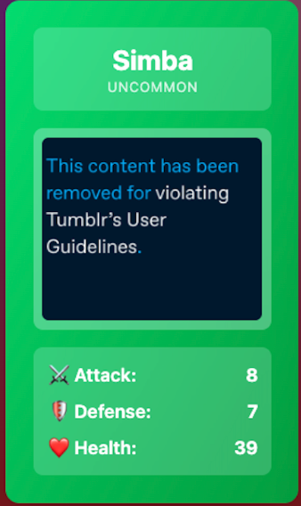

> 🔔 **Prelude:**
> Shall we have a talk about the strange issues?

## In release 0.2 week 2…

---

### **What I did**

This week I mainly worked on a small but interesting project: Cat Card battle ([https://github.com/JessieVela/cat-card-battle](https://github.com/JessieVela/cat-card-battle)). It’s a web-based game built with **Vue** and **TypeScript**, and styled using **Tailwind CSS**.

---

### **Working on (issue/PR)**

Early this week, I found a bug that caused some image URLs from **The Cat API** to redirect to Tumblr’s “content violation” placeholder instead of showing actual cat photos. Like this:

(Also see: [https://github.com/JessieVela/cat-card-battle/issues/23](https://github.com/JessieVela/cat-card-battle/issues/23))

So I decided to file this bug as an issue, and see if I can be assigned then fix it.

---

### **Need to know**

I have some experience with the **Vue** framework, but I needed to review a few of its concepts. Fortunately, the bug didn’t require any functional changes, so I could focus purely on **TypeScript** logic.

The next thing I needed was to understand how to use **The Cat API**. Luckily, they provide detailed documentation:

[https://developers.thecatapi.com/view-account/ylX4blBYT9FaoVd6OhvR?report=bOoHBz-8t](https://developers.thecatapi.com/view-account/ylX4blBYT9FaoVd6OhvR?report=bOoHBz-8t)

---

### **Difficulties**

The main challenge this week was Tumblr’s redirection behavior.

I used the **Network** tab in DevTools to trace why placeholder images were being returned and where they came from. Eventually, I found that some image requests returned a **301** status code, with a **Location** header pointing to a placeholder image.

To handle this, I added logic to detect 301 responses and fetch the image again. But strangely, even after refetching, the placeholder problem was still there. This make me wonder that whether I should dig deeper into Tumblr’s API mechanism — though that might have been too complex.

I finally decided that the issue was likely on **The Cat API’s** side, and it wasn’t worth pursuing further.

---

### **Fixes**

For the Tumblr image issue, I implemented a simple workaround: **temporarily filter out Tumblr-sourced images.** If an image source is detected to be from Tumblr, the app simply re-fetches until it gets the required number of images.

Now, all images come from CDN sources, which should theoretically be more stable.

Another challenge was **communication**.

After submitting the issue, the repository owner didn’t respond, but they did close another issue during that time. I feel a little bit confused about that but also not sure if I should follow up with them.

Since I already submitted a PR, I decided to wait for a while and may reach out to them proactively if there’s still no reply.

---

### **Considerations**

While handling the Tumblr image issue in the PR, I felt a lot of pain — every attempt to “check and re-fetch” still resulted in placeholder images. Then I realized something: if the goal is simply to **solve** the problem, a simpler solution works just as well — the source is unreliable, then I can just don’t use it.

Perhaps in practice, solving a problem doesn’t always require overthinking — sometimes the simplest solution is still effective.
