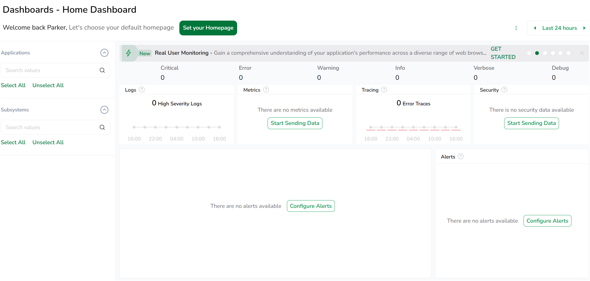
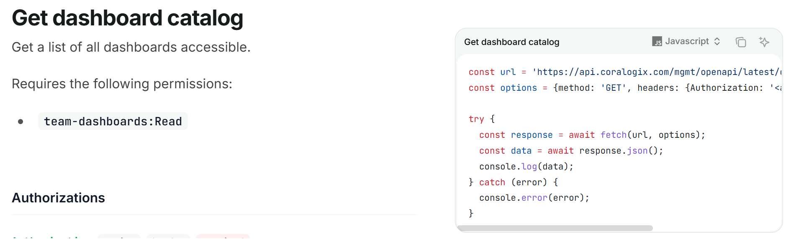
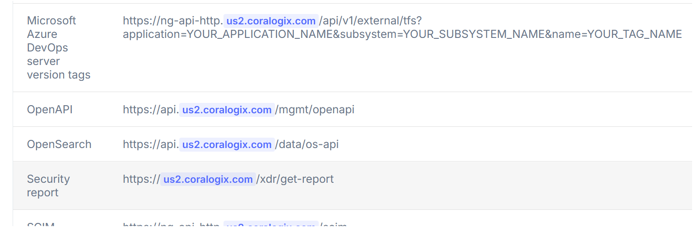
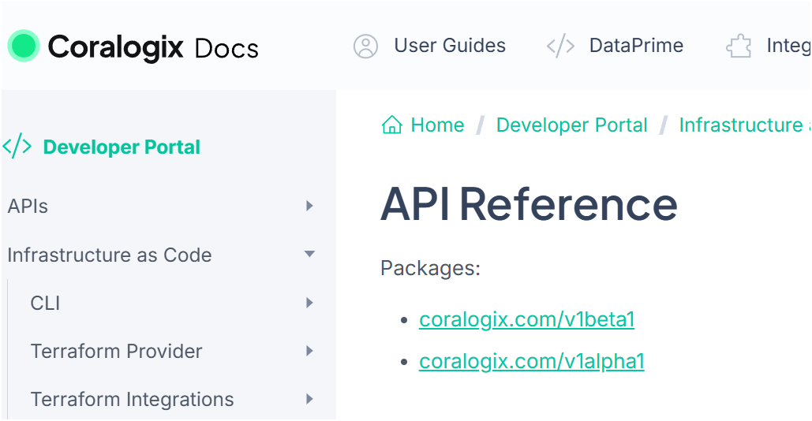
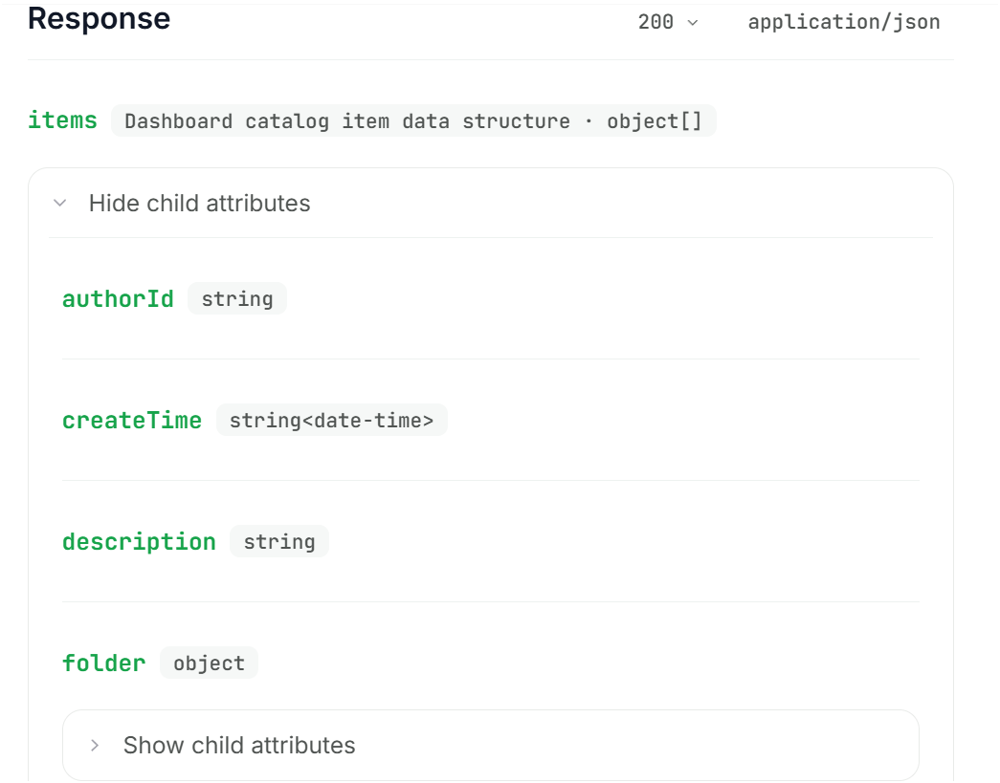

> 🔔 **Prelude:**
> API document reading — totally as hell

## Coralogix Integration

### What is it?

According to the official description, Coralogix provides “real-time insights and trend analysis for logs, metrics, and security data with no reliance on storage or indexing.”

In simpler terms, it is essentially a real-time server monitoring and observability service. Coralogix helps track logs, visualize metrics, and detect anomalies without requiring developers to manage complex storage systems. For projects with active deployments, this kind of integration makes debugging and performance monitoring much easier.

Coralogix’s Main Dashboard

My main task is to first fetch all the dashboards’ information to support further features.

### Challenges

1. Reading the API documentation turned out to be much harder than I expected. As shown in the screenshot：

    

    API Docs

    The example on the API usage page points to **`https://api.coralogix.com/`**. However, when I used this endpoint, I didn’t receive any meaningful response—only an API key permission error.

2. I went back to the dashboard and expanded my API key permissions all the way to the admin, but the error still appeared. That was when things started feeling really strange.
3. Since the issue clearly wasn’t about permissions, I began to suspect the endpoint itself. It didn’t make much sense that **everyone** would use the same entry point. So I spent a long time digging around the documentation… and eventually found the endpoint control page: [**https://coralogix.com/docs/integrations/coralogix-endpoints/**](https://coralogix.com/docs/integrations/coralogix-endpoints/)

    

    End Point demonstration

4. I was a bit frustrated — why wasn’t this mentioned anywhere on the main API page? And because the service is still relatively new, there is almost no discussion online; even AI tools didn’t help much. Honestly, I think it was part luck and part persistence that led me to the correct page. Otherwise, I would have wasted much more time.
5. By the way… there are also outdated API references still visible in the docs

    

    Huh?

    which makes things even more confusing.

6. Through this experience, I realized how important high-quality developer documentation is…

### Fixing

1. To implement the new feature, I mostly referenced another integration in the project : [https://github.com/OpsiMate/OpsiMate/blob/main/apps/server/src/bl/integrations/integration-connector/datadog-integration-connector.ts](https://github.com/OpsiMate/OpsiMate/blob/main/apps/server/src/bl/integrations/integration-connector/datadog-integration-connector.ts).

    Their implementation was very clean, so I could follow the structure and focus mainly on handling the data — the request and response parts.

2. And although the Coralogix documentation has some organization issues, the API page itself is straightforward. It clearly shows the response format, and the examples are easy to follow:

    

    A clear API response

    This made writing the actual code much easier.

3. Apart from the time I spent searching for the correct endpoint, the actual development process was quite enjoyable. Nothing beats the satisfaction of running a `curl` command and finally seeing the server return the correct data.
