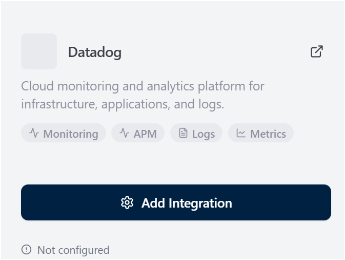
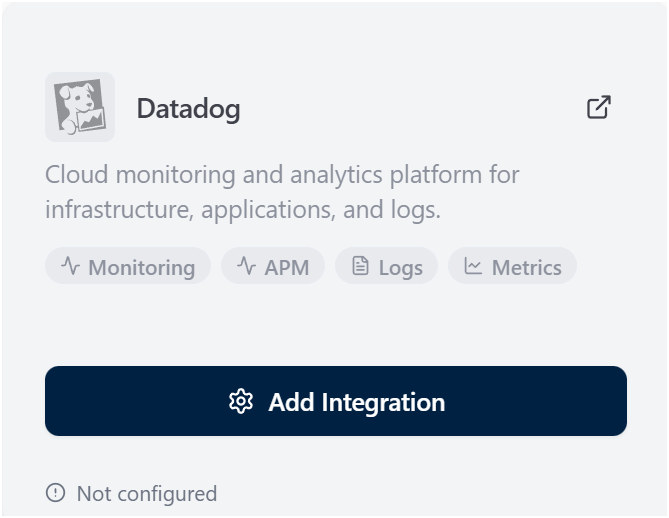
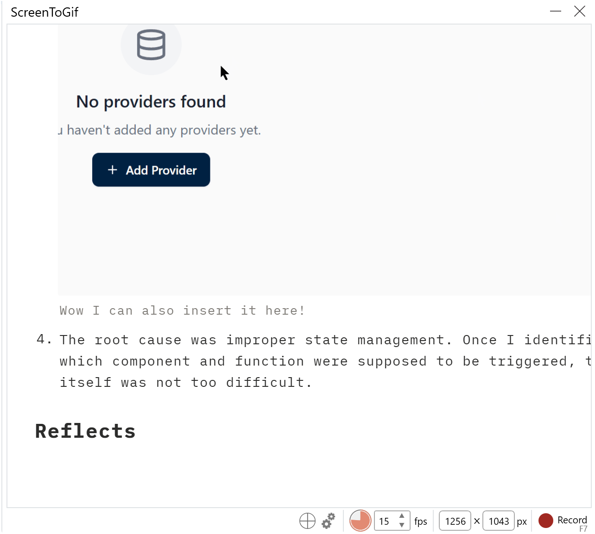

> 🔔 **Prelude:**
> Bugs in the middle of the way

## OpsiMate bugs fixing

During the development of the new Coralogix integration, I ended up discovering two UI bugs — because of course things like this always happen, right?

1. The first issue was a missing icon. This one was extremely small: a one‑line fix in a single file. Honestly the PR felt almost too tiny.
2. Fortunately, another bug appeared at exactly the right time. This one involved a UI element that refused to trigger properly, which required a bit more investigation and work.

### Missing dog

1. In my first blog post, I mentioned that OpsiMate includes a DataDog integration. Ironically, the dog went missing

    

    Where is the dog?

2. I attached the screenshot directly to the issue. It more or less explains the entire situation by itself [https://github.com/OpsiMate/OpsiMate/issues/557](https://github.com/OpsiMate/OpsiMate/issues/557).
3. I wasn’t sure if I had to follow the full issue template… describing such a simple visual bug felt also a little bit painful.
4. The fix was straightforward, and again, a screenshot was enough to show the completed result: [https://github.com/OpsiMate/OpsiMate/pull/560](https://github.com/OpsiMate/OpsiMate/pull/560)

    

    Doggy is back!

### Indifference button

1. The other issue was a button labeled “Add Provider” that refused to open the sidebar.
2. While researching good tools for recording UI interactions, I discovered ScreenToGif: [https://github.com/NickeManarin/ScreenToGif](https://github.com/NickeManarin/ScreenToGif) . It turned out to be incredibly useful, and I used it to record a small gif video and attach it to the issue.

    

    So easy for using

3. You can see the lively demonstration right in the issue: [https://github.com/OpsiMate/OpsiMate/issues/558](https://github.com/OpsiMate/OpsiMate/issues/558). It’s one of those situations that is very hard to explain clearly with text alone.

    

    Wow I can also insert it here!

4. The root cause was improper state management. Once I identified which component and function were supposed to be triggered, the fix itself was not too difficult.

### Reflects

Overall, even when you focus on a single PR, bugs still have a way of appearing continuously (sadly). There’s never a shortage of issues to work on — you don’t have to worry about “running out” of them.
