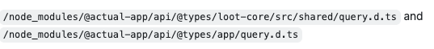
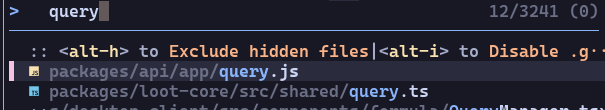

## Intro

My original goal for Release 0.4 was to contribute real code to a large open-source project related to finance. I completed that goal by working on Actual Budget, which is a fairly big project with around 23k stars.

### Thoughts About the Future

---

Now that I understand the workflow better, I hope I can eventually try adding a feature or modifying core code in a large codebase. I’m also paying attention to bigger finance-related libraries such as QuantLib, and maybe one day I will be able to contribute there as well.

Overall, I would say I accomplished what I wanted for this release — just not as fully as I expected. But it’s still a good start.

### How I Worked Through the Problem

---

Most of my technical work is understanding the project’s structure and figuring out how to safely fix the type issue. One important thing I learned was that the `.d.ts` files inside `/node_modules/@actual-app/...` are not the source code, even though ESLint and TypeScript errors pointed me there.

*.d.ts files for the issue desc

These files only describe the types, so the real fix needed to be applied in the actual source files with the same paths (not totally same).

… And their corresponding original files

Another useful technique I learned was compiling files directly using `tsc`. By compiling only the files I changed, I could quickly check whether the error was fixed.

But since I had to temporarily update the config to include my test files, it was easy to break something by accident. In this case, I relied on Git to get rid of all temp files and keep the repo clean before submitting the changes (To be honest, creating a totally new test branch is another good idea).

I must mention that, the “fork first, then work separately” workflow we learned in class this semester did help me a looooot for managing my chaotic developing process.

### Community, Communication, and the Open Source Mindset

---

After watching my classmates’ presentations, I realized that mastering a specific language is not the main requirement for open-source contribution. The real skill is always the communication: reading existing discussions, following instructions, asking questions when unsure, and respecting the time of maintainers.

Large projects usually have clear contributing guides, and Actual Budget is no exception. Their documentation explains workflow, expectations, and review rules in detail. As contributors, our responsibility is to follow these instructions first before doing anything else. Good communication keeps the whole project running smoothly; ignoring guidelines only creates extra work for others.

My PR also helped me experience the interaction between contributors and automated tools like Copilot, Coderabbitai, and many other review bots. They gave suggestions and asked for tests. Sometimes I felt a bit frustrated that I couldn’t discuss things with a real human; however, if I can solve the issue with bots alone, I guess it means I did a pretty good job, right…?

Overall, this release helped me understand more about two key concepts of the open source community: communication and respect.

I really enjoy the friendly and efficient communication among the contributors.
